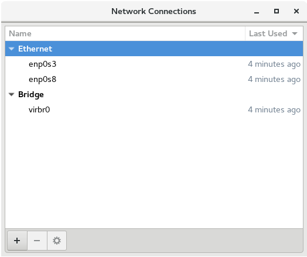
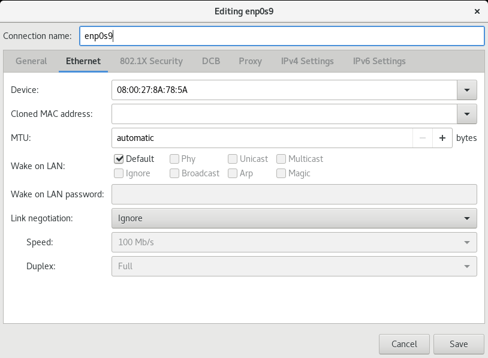
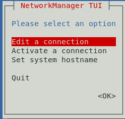
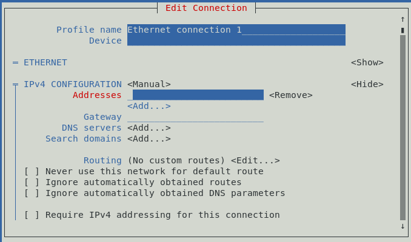

<!--
SPDX-FileCopyrightText: 2024 Mahyun Kim <mahyun.kim@navercorp.com>
SPDX-FileCopyrightText: 2024 NAVER Cloud Company

SPDX-License-Identifier: CC-BY-SA-4.0
-->
# 시스템 네트워크 구성

시스템을 네트워크에 연결하고 다른 시스템과 트래픽을 전송 및 수신하려면 식별 가능한 이름, IP 주소, 경로 등을 갖도록 시스템을 구성해야 합니다. 시스템의 사용 가능한 리소스에 따라 네트워크 연결 및 다중 경로 지정과 같은 추가 네트워크 기술을 구현하여 네트워크 구성을 더욱 최적화하여 고가용성과 향상된 성능을 얻을 수 있습니다.

## 네트워크 구성 도구

네트워크를 구성하는 데 다양한 도구를 사용할 수 있습니다. 이들 모두는 일반적으로 동일한 기능을 수행합니다. 네트워크를 관리하기 위해 임의의 도구 또는 도구 조합을 선택할 수 있습니다.

-   Cockpit은 네트워크 인터페이스, 본드, 브리지, 가상 VLAN 및 방화벽을 포함한 네트워크 구성을 관리하기 위한 웹 기반 구성 도구입니다.

-   GNOME 기반 도구

    Enterprise Linux를 설치하기 위해 기본 시스템(GUI 포함) 설치 프로필이나 환경을 선택한 경우 이러한 도구가 자동으로 포함됩니다.

    -   GNOME 설정 응용 프로그램을 사용하면 네트워킹을 포함한 다양한 시스템 구성을 수행할 수 있습니다. 이 애플리케이션에 액세스하려면 바탕 화면 오른쪽 상단에 있는 네트워크 아이콘을 클릭하고 **설정**을 선택하세요. 또는 데스크탑 메뉴 표시줄에서 활동을 클릭하고 애플리케이션 표시를 선택한 다음 설정을 선택하십시오. 왼쪽 패널의 목록에서 수행하려는 구성 유형을 선택합니다.
    -   네트워크 연결 편집기는 네트워크 구성을 직접 수행하는 데 사용할 수 있는 GNOME 설정 응용 프로그램의 하위 집합입니다. 편집기를 시작하려면 터미널 창에 `nm-connection-editor` 명령을 입력하세요.
-   `NetworkManager` 커맨드라인 도구

    Enterprise Linux를 설치하기 위해 GUI가 있는 서버 설치 프로필을 선택하지 않은 경우 이 도구를 사용하십시오.

    -   `NetworkManager`의 텍스트 기반 사용자 인터페이스\(TUI\)를 시작하려면 터미널 창에 `nmtui` 명령을 입력하세요. 마우스 장치 대신 키보드 키를 사용하여 인터페이스를 탐색합니다.
    -   `NetworkManager`의 커맨드라인은 다양한 하위 명령과 옵션이 포함된 `nmcli` 명령으로 구성됩니다. 하위 명령, 옵션 및 인수를 조합하여 단일 명령 구문으로 네트워크 구성을 완료할 수 있습니다. `ip` 및 `ethtool`과 같은 다른 명령은 네트워크 설정 구성 및 관리를 위해 `nmcli`를 보완합니다. 선택적으로 긴 명령을 입력하지 않으려면 대화형 모드에서 `nmcli`를 사용할 수 있습니다.

        자세한 내용은 `nmcli(1)`, `ip(8)` 및 `ethtool(8)` 매뉴얼 페이지를 참조하세요.


## 네트워크 인터페이스 구성

다음 정보는 이전 섹션에서 설명한 도구를 사용하여 NIC를 구성하는 방법을 설명합니다.

### 네트워크 인터페이스 이름 정보

전통적으로 초기 커널 버전에서는 일반적으로 장치 드라이버를 기반으로 하는 접두사와 `eth0`과 같은 숫자를 할당하여 네트워크 인터페이스 장치에 이름을 할당했습니다. 다양한 유형의 장치를 사용할 수 있으므로 이 명명 스키마는 더 이상 효율적이지 않습니다. 이름이 반드시 섀시 레이블과 일치할 필요는 없으며 이름 자체가 기존 네트워크 인터페이스에서 일관되지 않을 수 있습니다. 불일치는 추가 기능 어댑터를 포함하여 시스템에 내장된 어댑터에 영향을 미칩니다. 여러 네트워크 어댑터가 있는 서버 플랫폼에서는 이러한 인터페이스를 관리하는 데 문제가 있을 수 있습니다.

Enterprise Linux는 `udev` 장치 관리자를 통해 모든 네트워크 인터페이스에 대해 일관된 명명 체계를 구현합니다. 이 구현은 다음과 같은 장점을 제공합니다:

-   장치 이름은 예측 가능합니다.

-   장치 이름은 시스템 재부팅 후에도 유지되거나 하드웨어가 변경된 후에도 유지됩니다.

-   결함이 있는 하드웨어를 쉽게 식별하여 교체할 수 있습니다.


장치에서 일관된 이름 지정을 구현하는 기능은 기본적으로 Enterprise Linux에서 활성화됩니다. 네트워크 인터페이스 이름은 시스템 BIOS에서 파생된 정보를 기반으로 합니다. 또는 장치의 펌웨어, 시스템 경로 또는 MAC 주소를 기반으로 할 수도 있습니다.

네트워크 인터페이스는 접두사와 접미사가 결합된 이름으로 식별됩니다. 접두사는 네트워크 인터페이스 유형에 따라 다릅니다.:

-   이더넷 네트워크 인터페이스: `en`

-   무선 근거리 통신망\(LAN\) 인터페이스: `wl`

-   무선 광역 네트워크\(WAN\) 인터페이스: `ww`


접미사에는 다음 정보가 포함됩니다.:

-   온보드 인덱스 번호 `o*n*`, 즉 `eno0` .

-   핫 플러그 ​​슬롯 인덱스 번호 `s*n*`, 즉 `ens1`입니다.

    이 명명 스키마에는 접미사에 추가되는 `f*function*` 및 `d*device-id*`도 포함될 수 있습니다.

-   버스 및 슬롯 번호 `p*bus*s*n*`. 'enp0s8'.

    이 명명 스키마에는 접미사에 추가되는 `f*function*` 및 `d*device-id*`도 포함될 수 있습니다.

-   MAC 주소 `x*MAC-addr*`, 즉 `enx0217b08b`입니다.

    이 이름 지정 형식은 기본적으로 Enterprise Linux에서 사용되지 않습니다. 그러나 관리자는 이를 옵션으로 구현할 수 있습니다.


### 네트워크 연결 편집기 GUI 사용

1.  아직 설치되지 않은 경우 `nm-connection-editor` 패키지를 설치하세요.

    ```
    sudo dnf install -y nm-connection-editor
    ```

2.  편집기를 시작합니다.

    ```
    sudo nm-connection-editor
    ```

    편집기는 시스템에 있는 네트워크 장치를 감지하고 해당 장치와 현재 상태를 나열합니다.:

    

3.  연결을 추가하거나 제거하려면 편집기 창 하단에 있는 플러스 \( \) 또는 마이너스 \(-\) 버튼을 사용하세요.

    연결을 추가하면 연결 유형을 묻는 창이 열립니다. 드롭다운 목록에서 이더넷과 같은 유형을 선택한 다음 **만들기**를 클릭합니다. 인터페이스 편집기 창이 열립니다.

    **Note:**

    기존 연결을 편집하는 경우에도 동일한 창이 열립니다.

    

4.  필요에 따라 각 탭을 클릭하고 인터페이스에 대한 필수 정보를 입력합니다.

5.  구성을 완료한 후 **저장**을 클릭하세요.

    필수 정보를 모두 지정해야 합니다. 그렇지 않으면 설정을 저장할 수 없으며 편집기의 배경 터미널 창에 오류를 나타내는 메시지가 표시됩니다.


### 텍스트 기반 사용자 인터페이스 사용

1.  아직 설치되지 않은 경우 `NetworkManager-tui` 패키지를 설치하세요.

    ```
    sudo dnf install -y NetworkManager-tui
    ```

2.  `NetworkManager`의 텍스트 기반 사용자 인터페이스를 엽니다.

    ```
    sudo nmtui
    ```

    

    도구를 탐색하려면 위쪽 및 아래쪽 화살표 키를 사용한 다음 **Enter** 키를 눌러 선택하세요.

3.  연결을 추가하려면 **연결 수정**을 선택한 다음 **추가**를 클릭하세요.

4.  연결 유형을 선택하면 연결 편집 창이 열립니다.

    

5.  옵션으로 원하는 프로필 이름과 장치 이름을 지정합니다.

6.  기본적으로 IPv4 및 IPv6 구성은 자동으로 설정됩니다. 설정을 변경하려면 자동 필드를 선택하고 Enter를 누르십시오. 드롭다운 목록에서 수동과 같이 구현하려는 IP 구성 유형을 선택합니다. 그런 다음 해당 **표시** 필드를 선택합니다.

    표시되는 필드는 선택한 IP 구성 유형에 따라 다릅니다. 예를 들어, IP 주소를 수동으로 구성하기 위해 **표시**를 선택하면 다음 그림과 같이 인터페이스의 IP 주소를 입력할 주소 필드가 표시됩니다.

    

7.  화면의 모든 필드를 탐색하여 필수 정보가 지정되었는지 확인하세요.

8.  연결을 편집한 후 **확인**을 선택합니다.


### 커맨드라인 사용

`nmcli` 명령의 다양한 용도를 설명하기 위해 이 절차에서는 `enp0s2` 장치에 대한 새 이더넷 연결을 추가하고 구성하는 예를 설명합니다. 명령에 대한 자세한 내용은 `nmcli(1)` 매뉴얼 페이지를 참조하세요.

**Tip:**

연결을 추가하기 전에 다음과 같이 구성에 필요한 정보를 준비하십시오.:

-   연결 이름(예: `My Work Connection`)입니다. `nmcli` 명령은 장치 이름이 아닌 연결 이름을 참조하여 작동합니다. 연결 이름을 설정하지 않으면 장치 이름이 연결 이름으로 사용됩니다.

-   IP addresses \(IPv4 and, if needed, IPv6\)

-   Gateway addresses

-   연결을 위해 설정하려는 기타 관련 데이터


1.  \(Optional\): 시스템의 네트워크 장치를 표시합니다.

    ```
    sudo nmcli device status
    ```

    ```nocopybutton
    DEVICE  TYPE      STATE          CONNECTION
    enp0s1  ethernet  connected      enp0s1   
    enp0s2  ethernet  disconnected    --   
    lo      loopback  unmanaged
    
    ```

    이 명령은 장치가 연결되어 있는지, 연결이 끊어졌는지, 관리되는지 또는 관리되지 않는지 여부를 보여줍니다.

2.  \(선택 사항\) 네트워크 장치에 대한 연결 정보를 표시합니다.

    ```
    sudo nmcli con show [--active]
    ```

    ```nocopybutton
    NAME     UUID                                TYPE      DEVICE
    enp0s1   *nn-nn-nn-nn-nn*  ethernet  enp0s1
    virbr0   *nn-nn-nn-nn-nn*  bridge    virbr0
    mybond   *nn-nn-nn-nn-nn*  bond      bond0
    ```

    `con` 하위 명령은 `connection`의 축약형이며 `c`로 더 단축할 수 있습니다. `--active` 옵션을 지정하면 활성 장치만 표시됩니다.

    출력에서 `NAME`은 연결 ID를 나타냅니다.

3. 새 연결을 추가합니다.

    ```
    sudo nmcli con add {*properties*} [*IP-info*] [*gateway-info*
    ```

    -   **_properties_**

        `con-name` 인수로 지정된 연결 이름, `type` 인수로 지정된 연결 유형, `ifname` 인수로 지정된 인터페이스 이름입니다.

    -   **_IP-info_**

        'ip4' 또는 'ip6' 인수로 지정된 IPv4 또는 IPv6 주소입니다. 주소는 '주소/넷마스크' 형식이어야 합니다. IPv4 주소는 CIDR 형식일 수 있습니다(예: `1.2.3.4/24`).

    -   **_gateway-info_**

        'gw4' 또는 'gw6' 인수로 지정된 게이트웨이 IPv4 또는 IPv6 주소입니다.

    예를 들어, 이 절차 시작 부분에 있는 정보와 연결을 추가하려면 다음을 입력합니다.:

    ```
    sudo nmcli con add type ethernet ifname enp0s2 con-name "My Work Connection" ip4 192.168.5.10/24 gw4 192.168.5.2
    ```

    출력에서는 연결이 성공적으로 완료되었음을 확인합니다.

4.  인터페이스를 활성화합니다.

    ```
    sudo nmcli con up "My Work Connection"
    ```

5.  \(선택 사항\) 새 연결의 구성 속성을 표시합니다.

    ```
    sudo nmcli [-o] con show "My Work Connection
    ```

    ```nocopybutton
    connection.id:               My Work Connection
    connection.uuid:             *nn-nn-nn-nn-nn*
    connection.type:             802-3-ethernet
    connection.interface-name:   enp0s2
    ...
    IP4.ADDRESS[1]:              192.168.5.10
    IP4.GATEWAY:                 192.168.5.2
    ...
    ```

    '-o' 옵션을 지정하면 구성된 값이 있는 속성만 표시됩니다.


연결을 생성한 후에는 해당 프로필이 생성됩니다. 연결 프로필에 대한 자세한 내용은 다음을 참조하세요. [NetworkManager 연결 프로필 사용](ko-network-ConfiguringtheSystemsNetwork.md#networkmanager-연결-프로필-사용).

```
ls -lrt /etc/sysconfig/network-scripts/ifcfg*
```

```nocopybutton
...
-rw-r--r--. 1 root root 266 Aug  6 11:03 /etc/sysconfig/network-scripts/ifcfg-My_Work_Connection
```

## 네트워크 라우팅 구성

시스템은 라우팅 테이블을 사용하여 원격 시스템에 패킷을 보낼 때 사용할 네트워크 인터페이스를 식별합니다. 단일 인터페이스만 있는 시스템의 경우 로컬 네트워크에서 게이트웨이 시스템의 IP 주소를 구성하면 패킷을 다른 네트워크로 라우팅하는 데 충분합니다. 예를 들어, 기본 게이트웨이의 IP 주소를 입력할 수 있는 필드를 보여주는 [그림 5](ko-network-ConfiguringtheSystemsNetwork.md#tui-addaddress)의 이미지를 참조하십시오.

여러 IP 인터페이스가 있는 시스템에서는 특수 호스트나 네트워크에 대한 트래픽이 기본 게이트웨이를 통해 해당 네트워크로 전달되도록 정적 경로를 정의할 수 있습니다. 네트워크 인터페이스를 구성할 때와 동일한 도구를 사용하여 라우팅을 구성합니다.

### 네트워크 연결 편집기 사용

게이트웨이 198.51.100.1을 통해 192.0.2.0/24 네트워크에 대한 고정 경로를 생성하려면 먼저 인터페이스에서 기본 게이트웨이 198.51.100.1에 연결할 수 있는지 확인하십시오. 그런 다음 다음 단계를 완료하세요:

1.  편집기를 시작합니다.

    ```
    nm-connection-editor
    ```

2.  연결 목록에서 고정 경로를 생성하려는 연결 이름 아래의 장치를 선택합니다. 예를 들어 `myconnection`에서 `ens3` 장치를 선택합니다.
3.  연결 설정을 편집하려면 설정 아이콘\(톱니바퀴\)을 클릭하세요.
4.  IPv4 설정 탭을 클릭합니다.
5.  클릭 **Routes**.
6.  클릭 **Add**.
7.  경로가 생성되는 네트워크 주소와 넷마스크를 입력하고, 경로가 설정되는 게이트웨이 IP 주소를 지정합니다. 선택적으로 측정항목 값을 입력하고 표시되는 다른 사용 가능한 옵션을 선택할 수 있습니다.

    

8.  **확인**을 클릭한 다음 저장하세요.
9.  터미널 창으로 돌아가 연결을 다시 시작합니다.

    이 단계를 수행하면 연결이 일시적으로 끊어집니다.

    ```
    sudo nmcli connection up myconnection
    ```

10. 선택적으로 새 경로가 활성 상태인지 확인합니다.

    ```
    ip route
    ```

    ```nocopybutton
    ...
    192.0.2.0/24 via 198.51.100.1 dev myconnection proto static metric 100
    ```


### 커맨드라인 사용

`nmcli` 명령을 사용하여 정적 경로를 구성하려면 다음 구문을 사용하십시오.:

```
nmcli connection modify *connection\_name* +ipv4.routes "*ip*[/*prefix*] *options\(s\)* *attribute\(s\)*"[next_hop] [metric] [attribute=value] [attribute=value] ..."
```

-   **+ipv4.routes**

    더하기 \( \) 기호는 IPv4 경로를 생성 중임을 나타냅니다. 기호가 없으면 명령은 기존 IPv4 설정을 변경합니다.

-   **_connection-name_**

    고정 경로를 생성하는 연결 이름 또는 레이블입니다.

-   **_ip_\[/_prefix_\]**

    생성 중인 고정 경로의 IP 주소입니다. IP 주소는 CIDR 표기법 사용도 가능합니다.

-   **_options_**

    옵션에는 다음 홉 주소와 선택적 경로 메트릭이 포함됩니다. 이러한 옵션은 공백으로 구분됩니다. 자세한 내용은 `nm-settings-nmcli(5)` 매뉴얼 페이지를 참조하세요.

-   **_attributes_**

    속성은 *속성=값*으로 입력되며 공백으로 구분됩니다. 일부 속성에는 `mtu`, `src`, `type`, `cwnd` 등이 있습니다. 자세한 내용은 `nm-settings-nmcli(5)` 매뉴얼 페이지를 참조하세요.


다음과 같은 구성이 있다고 가정합니다.

-   연결 이름: `myconnection`
-   기본 게이트웨이 주소: 198.51.100.1
-   statci 경로를 생성하려는 네트워크: 192.0.2.0/24

경로를 생성하려면 먼저 인터페이스에서 해당 경로의 기본 게이트웨이에 직접 연결할 수 있는지 확인하세요. 이 후 다음을 수행하십시오.:

1.  정적 경로를 생성합니다.

    ```
    sudo nmcli connection modify myconnection +ipv4.routes "192.0.2.0/24 198.51.100.1"
    ```

    단일 명령으로 여러 정적 경로를 생성하려면 *route Gateway* 항목을 쉼표로 구분하세요. 예를 들어:

    ```
    sudo nmcli connection modify myconnection +ipv4.routes "192.0.2.0/24 198.51.100.1, 203.0.113.0/24 198.51.100.1"
    ```

2.  새 라우팅 구성을 확인합니다.

    ```
    nmcli connection show myconnection
    ```

    ```nocopybutton
    –-
    ipv4.routes:   { ip = 192.0.2.0/24, nh = 198.51.100.1 }
    –-
    ```

3.  네트워크 연결을 다시 시작하십시오.

    This step causes the connection to temporarily drop.

    ```
    sudo nmcli connection up myconnection
    ```

4.  선택적으로 새 경로가 활성 상태인지 확인합니다.

    ```
    ip route
    ```

    ```nocopybutton
    ...
    192.0.2.0/24 via 198.51.100.1 dev example proto static metric 100
    ```


### 대화형 모드에서 커맨드라인 사용

대화형 모드에서 `nmcli` 명령을 사용하여 정적 경로 구성을 포함한 네트워크 설정을 구성할 수도 있습니다. 대화형 모드에서는 명령을 실행하여 특정 연결 프로필에 대한 정적 경로를 구성할 수 있는 `nmcli>` 프롬프트가 나타납니다.

이 섹션의 절차에서는 고정 경로를 생성하기 위해 다음 네트워크 설정을 가정합니다.:

-   연결 이름: `myconnection`
-   기본 게이트웨이 주소: 198.51.100.1
-   statci 경로를 생성하려는 네트워크: 192.0.2.0/24

경로를 생성하려면 먼저 인터페이스에서 해당 경로의 기본 게이트웨이에 직접 연결할 수 있는지 확인하세요. 그런 다음 다음을 수행하십시오.:

1.  명령의 대화형 모드를 시작합니다.

    ```
    sudo nmcli connection modify myconnection
    ```

    ```nocopybutton
    nmcli>
    ```

2.  정적 경로를 생성합니다.

    ```
    nmcli> set ipv4.routes 192.0.2.0/24 198.51.100.1
    ```

3.  선택적으로 새 구성을 표시합니다.

    ```
    nmcli> print
    ```

    ```nocopybutton
    ...
    ipv4.routes:        { ip = 192.0.2.1/24, nh = 198.51.100.1 }
    ...
    ```

4.  구성을 저장합니다.

    ```
    nmcli> save persistent
    ```

5.  네트워크 연결을 다시 시작하십시오.

    This step causes the connection to temporarily drop.

    ```
    nmcli> activate myconnection
    ```

6.  대화형 모드를 종료합니다.

    ```
    nmcli> quit
    ```

7.  선택적으로 새 경로가 활성 상태인지 확인합니다.

    ```
    ip route
    ```

    ```nocopybutton
    ...
    192.0.2.0/24 via 198.51.100.1 dev example proto static metric 100
    ```


## NetworkManager 연결 프로필 사용

생성한 각 네트워크 연결 구성은 시스템의 'NetworkManager' 연결 프로필이 됩니다. Enterprise Linux 9에서는 프로필이 키 파일 형식만 가능합니다. Enterprise Linux 9에서는 네트워크 스크립트가 제거되었기 때문에 이러한 스크립트를 관리하는 'ifcfg' 형식 기능도 제거되었습니다.

목적에 따라 'NetworkManager' 연결 프로필은 다음 위치 중 하나에 저장될 수 있습니다.:

-   `/etc/NetworkManager/system-connections/`: 사용자가 생성한 영구 프로필의 기본 위치입니다. 이 디렉터리의 프로필도 편집할 수 있습니다.
-   `/run/NetworkManager/system-connections/`: 시스템을 재부팅할 때 자동으로 제거되는 임시 프로필의 위치입니다.
-   `/usr/lib/NetworkManager/system-connections/`: 사전 배포된 영구 연결 프로필의 위치입니다. `NetworkManager` API를 사용하여 이러한 프로필 중 하나를 편집하면 해당 프로필이 영구 디렉터리나 임시 디렉터리에 복사됩니다.

'NetworkManager' 연결 프로필 구성에 대한 자세한 내용은 다음을 참조하세요.:

-   [nmcli를 사용하여 오프라인 모드에서 키 파일 연결 프로필 생성](ko-network-ConfiguringtheSystemsNetwork.md#nmcli를-사용하여-오프라인-모드에서-keyfile-연결-프로필-생성)
-   [수동으로 keyfile 연결 프로필 만들기](ko-network-ConfiguringtheSystemsNetwork.md#수동으로-keyfile-연결-프로필-만들기)
-   [연결 프로필 형식 간의 프로세스 차이점과 이름 바꾸기](ko-network-ConfiguringtheSystemsNetwork.md#연결-프로필-형식-간의-프로세스-차이점과-이름-바꾸기)
-   [연결 프로필 형식을 ifcfg에서 keyfile로 변환](ko-network-ConfiguringtheSystemsNetwork.md#연결-프로필-형식을-ifcfg에서-keyfile로-변환)

### nmcli를 사용하여 오프라인 모드에서 keyfile 연결 프로필 생성

`NetworkManager` 프로필 연결을 생성하거나 업데이트할 때 오프라인 모드\(`nmcli --offline`\)에서 CLI 도구를 사용하는 것이 좋습니다. 오프라인 모드에서 'nmcli'는 사용자에게 향상된 편집 제어 기능과 'keyfile' 형식의 다양한 연결 프로필을 생성하는 기능을 제공하는 'NetworkManager' 서비스 없이 작동합니다. 예를 들어 `keyfile` 형식으로 다음 유형의 연결 프로필을 생성할 수 있습니다.:

-   정적 이더넷 연결
-   동적 이더넷 연결
-   네트워크 본드
-   네트워크 브리지
-   VLAN 또는 모든 종류의 활성화된 연결

오프라인 모드에서 `nmcli`를 사용하여 `keyfile` 연결 프로필을 생성하려면 다음 단계를 따르세요.:

1.  오프라인 모드에서 프로필 연결을 생성하려면 필수 `NetworkManager` 구성 속성을 사용하세요.

    예를 들어, 다음 구문은 수동으로 할당된 IPv4 주소 및 DNS 주소를 사용하여 이더넷 장치에 대해 오프라인 모드에서 키 파일 연결 프로필을 생성합니다.

    ```
    nmcli --offline connection add type ethernet con-name *Example-Connection* ipv4ddresses *\#\#\#.\#.\#.\#/\#* ipv4ns *\#\#\#.\#.\#.\#\#\#* ipv4ethod manual > /etc/NetworkManager/system-connections/*outputmconnection*
    ```

    *파라메터 설명*:

    -   `nmcli --offline` = `nmcli`가 오프라인 모드에서 작동하도록 지시하는 ncmi 모드 속성입니다.
    -   `connection add type ethernet` = 연결 프로필을 생성하고 연결 유형 값 \(이 예에서는 이더넷\)을 지정하는 데 사용되는 연결 및 유형 속성을 추가합니다.
    -   `con-name` = 생성된 연결 프로필의 `id` 변수에 저장되는 연결 이름 속성입니다.

        나중에 `nmcli`를 사용하여 이 연결을 관리할 때 다음 `id` 변수 사용법에 유의하세요.:

        -   `id` 변수가 제공되는 경우 연결 이름을 사용합니다. 예를 들어: `Example-Connection`.
        -   `id` 변수가 생략된 경우 `.nmconnection` 접미사 없이 파일 이름을 사용합니다(예: `output`).
        
        **Note:** 연결 프로필 속성 및 해당 설정에 대한 자세한 내용은 `nm-settings(5)` 매뉴얼 페이지를 참조하세요.

2.  '루트' 사용자만 읽고 업데이트할 수 있도록 구성 파일에 대한 권한을 설정합니다. 예를 들어:

    ```
    chmod 600 /etc/NetworkManager/system-connections/*outputmconnection*
    chown root:root /etc/NetworkManager/system-connections/*outputmconnection*
    ```

3.  'NetworkManager' 서비스 시작:

    ```
    systemctl start NetworkManager.service
    ```

4.  프로필의 `autoconnect` 변수를 `false`로 설정한 경우 연결을 활성화합니다.:

    ```
    nmcli connection up *Example-Connection*
    ```

5.  \(선택 사항\) 프로필 구성을 확인하려면 다음 단계를 수행하십시오.:
    1.  예를 들어 'NetworkManager' 서비스가 실행 중인지 확인하세요.:

        ```
        systemctl status NetworkManager
        ● NetworkManager.service - Network Manager
           Loaded: loaded (/usr/lib/systemd/system/NetworkManager.service enabled vendor preset: enabled)
           Active: active (running) because Wed -03 13:08:32 CEST   ago
        
        ```

    2.  예를 들어 `NetworkManager`가 구성 파일에서 프로필을 읽을 수 있는지 확인하세요.:

        ```
        nmcli -f TYPE,FILENAME,NAME connection
        TYPE      FILENAME                                                    NAME
        ethernet /etc/NetworkManager/system-connections/outputmconnection Example-Connection
        ethernet  /etc/sysconfig/network-scripts/ifcfg-enp0                 enp0
        
        ```

        출력에 새로 생성된 연결이 표시되지 않으면 `keyfile` 권한과 사용된 구문이 올바른지 확인하세요.

    3.  연결 프로필을 표시하려면 `nmcli Connection show` 명령을 사용하십시오. 예를 들어:

        ```
        nmcli connection show *Example-Connection*
        connection.id:                          Example-Connection
        connection.uuid:                        ce8d4422-9603-4d6f-b602-4f71992c49c2
        connection.stable-id:                   --
        connection.type:                        802-3-ethernet
        connection.interface-name:              --
        connection.autoconnect:                 yes
        ```


### 수동으로 keyfile 연결 프로필 만들기

키 파일 형식으로 'NetworkManager' 연결 프로필을 수동으로 생성하려면 다음 단계를 따르세요.:

**Note:** 구성 파일을 수동으로 생성하거나 업데이트하면 예기치 않은 네트워크 구성이 발생할 수 있습니다. 또 다른 옵션은 오프라인 모드에서 `nmcli`를 사용하는 것입니다. 아래는 참조하세요.

1.  이더넷과 같은 하드웨어 인터페이스에 대한 프로필을 생성하는 경우 하드웨어의 MAC 주소를 표시합니다.

    ```
    ip address show ens3
    ```

    ```
    2: ens3: <BROADCAST,MULTICAST,UP,LOWER_UP> mtu 9000 qdisc pfifo_fast state UP group default qlen 1000
        link/ether 02:00:17:03:b9:ae brd ff:ff:ff:ff:ff:ff
        ...
    ```

2.  텍스트 편집기를 사용하여 연결에 대해 정의하려는 네트워크 설정이 포함된 연결 프로필을 만듭니다.

    예를 들어 연결에서 DHCP를 사용하는 경우 프로필에는 다음 예와 유사한 설정이 포함됩니다.:

    ```
    [connection]
    id=myconnection
    type=ethernet
    autoconnect=true
    
    [ipv4]
    method=auto
    
    [ipv6]
    method=auto
    
    [ethernet]
    mac-address=02:00:17:03:b9:ae
    ```

3.  프로필을 `/etc/NetworkManager/system-connections/*filname*.nmconnection`에 저장합니다.

    현재 절차에서 프로필은 `/etc/NetworkManager/system-connections/myconnection.nmconnection`입니다.

    **note:** `myconnection`과 같이 정의된 ID 변수는 프로필의 파일 이름(예: `myethernet.nmconnection`)과 동일할 필요는 없습니다. `nmcli` 명령을 사용하여 프로필을 변경하면 정의된 ID \(`myconnection`\) 또는 파일 이름으로 프로필을 식별할 수 있지만 파일 확장자 이름 \(`myethernet`\)은 제외됩니다.

4.  프로필의 권한을 제한합니다.

    ```
    sudo chown root:root /etc/NetworkManager/system-connections/myconnection.nmconnection
    sudo chown 600 /etc/NetworkManager/system-connections/myconnection.nmconnection
    ```

5.  연결 프로필을 다시 로드합니다.

    ```
    sudo nmcli connection reload
    ```

6.  `NetworkManager`가 프로필을 읽을 수 있는지 확인하세요.

    ```
    sudo nmcli -f NAME,UUID,FILENAME connection
    ```

    ```
    NAME           UUID       FILENAME
    myconnection   *uuid*        /etc/NetworkManager/system-connections/myconnection.nmconnection
    ```

7.  프로필의 'autoconnect' 매개변수에 대해 'false'를 지정한 경우 연결을 활성화하세요.

    ```
    sudo nmcli connection up myconnection
    ```


### 연결 프로필 형식 간의 프로세스 차이점과 이름 바꾸기

인터페이스에 사용자 정의 이름을 할당해야 하는 경우 `udev` 서비스 이름 변경 프로세스는 연결 프로필의 형식에 따라 다르게 작동합니다. 예를 들어,

-   `ifcfg` 형식 인터페이스 이름 변경 프로세스에는 다음 단계가 포함됩니다.:
    1.  `/usr/lib/udev/rules.d/60-net.rules` `udev` 규칙은 `/lib/udev/rename_device` 헬퍼 유틸리티를 호출합니다.
    2.  헬퍼 유틸리티는 `/etc/sysconfig/network-scripts/ifcfg-*` 파일에서 `HWADDR` 매개변수를 검색합니다.
    3.  변수에 설정된 값이 인터페이스의 MAC 주소와 일치하는 경우 헬퍼 유틸리티는 인터페이스 이름을 파일의 `DEVICE` 매개변수에 설정된 이름으로 바꿉니다.
-   `keyfile` 형식 인터페이스 이름 변경 프로세스에는 다음 단계가 포함됩니다.:
    1.  인터페이스 이름을 바꾸려면, [systemd link file](https://access.redhat.com/documentation/en-us/red_hat_enterprise_linux/8/html/configuring_and_managing_networking/consistent-network-interface-device-naming_configuring-and-managing-networking#configuring-user-defined-network-interface-names-by-using-systemd-link-files_consistent-network-interface-device-naming) 또는 [udev rule](https://access.redhat.com/documentation/en-us/red_hat_enterprise_linux/8/html/configuring_and_managing_networking/consistent-network-interface-device-naming_configuring-and-managing-networking#configuring-user-defined-network-interface-names-by-using-systemd-link-files_consistent-network-interface-device-naming) 을 생성하세요.
    2.  `NetworkManager` 연결 프로필에서 `interface-name` 속성에 사용자 정의 이름을 지정합니다.

### 연결 프로필 형식을 ifcfg에서 keyfile로 변환

`NetworkManager` 기존 `ifcfg` 프로필 형식을 기본 `NetworkManager` `keyfile` 형식으로 변환하려면 다음 단계를 따르세요.:

**Note:** `keyfile` 프로필 형식에 대한 자세한 내용은 [nm-settings-keyfile\(5\)](https://networkmanager.dev/docs/api/latest/nm-settings-keyfile.html) 메뉴얼 페이지를 참고하세요.

1.  다음 필수 구성 요소가 충족되는지 확인하세요.:
    -   `/etc/sysconfig/network-scripts/` 디렉토리에 저장되어 있는 `ifcfg` 형식의 기존 연결 프로필.
    -   연결 프로필에 `provider` 또는 `lan`과 같은 맞춤 장치 이름으로 설정된 `DEVICE` 변수가 포함된 경우 각 맞춤 장치 이름에 대해 `systemd` 링크 파일 또는 `udev` 규칙을 생성한 것입니다. .
2.  `nmcli`를 사용하여 `ifcfg` 연결 프로필을 기본 `keyfile` 형식으로 마이그레이션합니다.

    ```
    nmcli connection migrate
    ```

3.  \(선택 사항\) 모든 기존 `ifcfg` 연결 프로필이 성공적으로 마이그레이션되었는지 확인:

    ```
    nmcli -f TYPE,FILENAME,NAME connection
    ```


